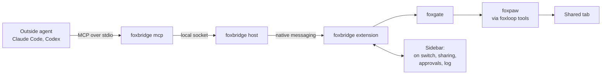
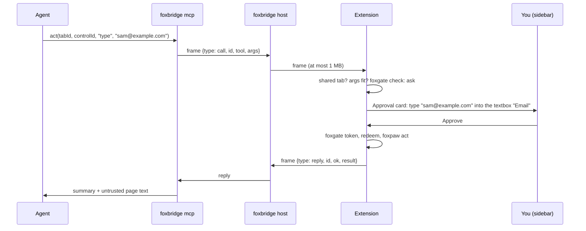
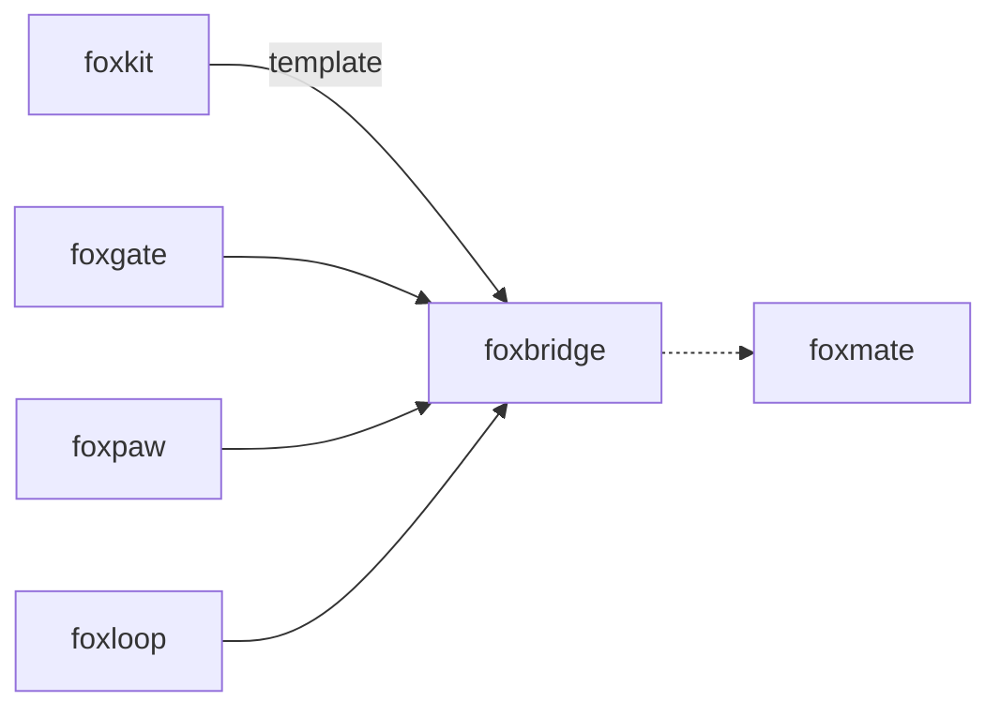

# foxbridge

<p align="center">Let outside agents such as Claude Code use fox primitives through MCP.</p>

<p align="center">
  <a href="https://github.com/pooriaarab/foxbridge/actions"></a>
  <a href="LICENSE"></a>
</p>

foxbridge connects an outside agent, for example Claude Code or Codex, to the
Firefox you already use. The agent sees only the tabs that you share. It can
read a shared tab. Each change waits until you approve it in the foxbridge
sidebar. The agent never gets your cookies or your passwords.

foxbridge has three parts in one npm package and one extension:

- `foxbridge mcp`: an MCP server on stdio. Your agent starts it.
- `foxbridge host`: a native messaging host. Firefox starts it when you turn
  on the bridge.
- The foxbridge extension: the sidebar, the shared tabs, and the approvals.
  It runs [foxpaw](https://github.com/pooriaarab/foxpaw) through
  [foxloop](https://github.com/pooriaarab/foxloop)'s browser tools, and asks
  [foxgate](https://github.com/pooriaarab/foxgate) before each action.

## Install

```bash
npm i -g foxbridge
```

Then do these steps one time:

1. Write the native messaging host manifest for Firefox:

   ```bash
   foxbridge install
   ```

2. Add the extension to Firefox. Use the `.xpi` file from a
   [GitHub release](https://github.com/pooriaarab/foxbridge/releases), or
   build it with `pnpm build:ext` and load `dist-ext/manifest.json` from
   `about:debugging`.
3. Register the MCP server with your agent. For Claude Code:

   ```bash
   claude mcp add foxbridge -- foxbridge mcp
   ```

4. In Firefox, click the foxbridge button to open the sidebar. Click
   **Turn on**, and tick **Share** next to a tab.

Run `foxbridge status` when the sidebar says that Firefox could not start the
host.

## Example

The MCP tools are the main way to use foxbridge. The library gives the same
calls to your own Node code. This runs in Node 24 or later when the bridge is
on:

```js
import { connectBridge } from "foxbridge";

const bridge = await connectBridge();
const tabs = await bridge.call("list_tabs", {});
console.log(tabs.summary); // for example: 1 shared tab: tab 12 on github.com.
bridge.close();
```

When the bridge is off, `connectBridge` throws a `FoxbridgeError` with the
code `bridge-off` and a message that says how to turn it on.

## Use cases

| Who | What they build | How foxbridge helps |
|---|---|---|
| A developer who uses Claude Code or Codex | "Open my staging admin page and check the new setting", in the browser where they are already logged in | The agent uses the real session in a shared tab. It never sees the cookies. Each click waits for an approval in the sidebar. |
| A QA engineer who works in a terminal | A terminal agent that fills a form on a test site and reads the result | `run_task` fills and sends the form with foxpaw and returns foxpaw's check. `snapshot` shows the page again. |
| A researcher | An agent that reads pages from a paywalled library that the researcher is logged in to | Shared tabs give the agent the page text. The text arrives marked as untrusted data, so the agent can keep it apart from instructions. |
| An accessibility tool author | A voice or switch tool that asks an outside model "what can I do on this page?" | `snapshot` gives each control with its role and its accessible name. `act` types or selects for the user after an approval. |
| A person who writes small scripts | A Node script that lists the shared tabs, or opens a set of pages for a morning check | `connectBridge` gives the same calls as the MCP tools, with the same approvals. |
| An agent framework author | A tool for an agent that must act in a browser that a human controls | The human stays in control: an on switch, sharing per tab, an approval for each change, and a kill switch. |

## How it works



1. You turn on the bridge in the sidebar. The extension calls
   `runtime.connectNative("foxbridge")`, and Firefox starts `foxbridge host`.
2. The host listens on a local socket. The socket is in `~/.foxbridge`
   (mode 0700), or on a named pipe on Windows.
3. Your agent starts `foxbridge mcp`. On the first tool call, the MCP server
   connects to the socket. The sidebar shows **Agent connected**.
4. The extension refuses a call for a tab that you did not share. It checks
   the arguments again with the foxloop schema.
5. It asks foxgate. Sharing a tab adds grants for the site of that tab:
   `snapshot` needs no approval, and `act`, `click` and `run_task` always
   need one. `open_url` always needs one.
6. For an approval, the sidebar shows the action in plain words and its exact
   JSON. Approve gives a foxgate token for that one action. Deny, the
   approval time, or the kill switch runs nothing.
7. The tool runs through foxpaw in the page. Page text goes back to the agent
   in its own block, inside tags with a random nonce.



### Message protocol

Every link uses Firefox's native messaging frame: a 32-bit length in native
byte order, then that many bytes of UTF-8 JSON.

| Link | Limit | Messages |
|---|---|---|
| MCP server to host (socket) | 8 MB | `call {id, tool, args}`, `cancel {id}` |
| Host to MCP server | 8 MB | `hello`, `refused {code}`, `reply {id, ok, result \| error}` |
| Host to extension (stdout) | 1 MB, set by Firefox | `ready`, `agent {connected}`, `call`, `cancel`, `host-error` |
| Extension to host (stdin) | 8 MB, set by foxbridge | `reply {id, ok, result \| error}` |

- The MCP server gives each call a random id. The host passes only answers
  for ids that wait, one agent at a time.
- A call over 1 MB fails with `too-large` before Firefox sees it.
- A call waits at most 180 s (`FOXBRIDGE_TIMEOUT_MS`). Then the MCP server
  sends `cancel`, and the extension drops the approval.
- An approval waits 120 s by default. You can set 2 to 150 s in the sidebar.
- When the host stops, every waiting call fails at once with `host-gone`.

Every failure mode has a test or an E2E check: see
[docs/failure-modes.md](docs/failure-modes.md).

## API

### MCP tools

| Tool | Arguments | What it does |
|---|---|---|
| `list_tabs` | none | The shared tabs: tab id, site and title. |
| `snapshot` | `tabId` | The controls and the text of a shared tab. No approval. |
| `act` | `tabId`, `controlId`, `op`, `value?` | Types, selects, checks, unchecks, sets a date or scrolls one control from the last snapshot. Needs an approval. |
| `click` | `tabId`, `controlId` | Clicks one control from the last snapshot. Needs an approval. |
| `run_task` | `tabId`, `goal` | Runs foxpaw's `runTask`, for example `email: sam@example.com, accept the terms`. One approval covers the run. |
| `open_url` | `url` | Opens an `http:` or `https:` address in a new tab and shares it. Needs an approval. |

A refusal is an MCP result with `isError: true` and a code:
`bridge-off`, `busy`, `host-gone`, `timeout`, `too-large`, `not-shared`,
`bad-args`, `denied`, `approval-denied`, `approval-timeout`,
`approval-cancelled` or `unknown-tool`.

### CLI

| Command | What it does |
|---|---|
| `foxbridge install [--extension-id <id>]` | Writes the launcher `~/.foxbridge/foxbridge-host` and the host manifest. On Windows, it also writes `HKCU\Software\Mozilla\NativeMessagingHosts\foxbridge`. |
| `foxbridge uninstall` | Removes them. |
| `foxbridge status` | Checks the manifest, the extension id and the launcher. Exits 1 with the problems. |
| `foxbridge mcp` | Runs the MCP server on stdio. |
| `foxbridge host` | Runs the native messaging host. Firefox starts it. |

The manifest goes to
`~/Library/Application Support/Mozilla/NativeMessagingHosts/foxbridge.json`
on macOS and `~/.mozilla/native-messaging-hosts/foxbridge.json` on Linux.
Its `allowed_extensions` holds only `foxbridge@pooriaarab`.
`FOXBRIDGE_SOCKET` changes the socket path for both the host and the MCP
server.

### Library

| Export | What it does |
|---|---|
| `connectBridge({ socketPath?, timeoutMs? })` | Connects to the host. Returns `{ call(tool, args), close(), closed }`. |
| `createMcpServer({ connect?, nonce?, version? })` | The MCP server, for your own transport. |
| `runHost({ input, output, socketPath, log? })` | The native messaging host on any two streams. |
| `install`, `uninstall`, `status`, `manifestDir`, `hostManifest` | The host manifest. |
| `encodeFrame`, `FrameReader`, `LIMITS` | The frames and their limits. |
| `formatReply`, `wrapUntrusted`, `UNTRUSTED_NOTE` | How page text goes back to the agent. |
| `FoxbridgeError` | Has a `code`. |

### Demo extension

The foxbridge extension is the demo. Its sidebar has an on switch, an agent
indicator, the tabs to share, the approval cards, an activity log, the
approval time, and **Stop now**. Stop now closes the native port, denies what
waits, and stops all sharing. Turn off does the same.

```bash
pnpm install
pnpm e2e    # Firefox, the real host manifest, a real MCP client
```

`pnpm e2e` installs the host manifest for your user and puts back what was
there after the run. Our run on 2026-10-09 (Firefox 157.0.1, macOS, headless)
passed 36 checks. With a 2 s idle timeout, the event page unloaded when no
port was open, and it stayed loaded for 8 s while the native port was open.

## Firefox APIs used

| API | MDN | Why |
|---|---|---|
| `runtime.connectNative`, `runtime.Port` | [MDN](https://developer.mozilla.org/en-US/docs/Mozilla/Add-ons/WebExtensions/API/runtime/connectNative) | Starts the host and talks to it. |
| `nativeMessaging` permission and host manifest | [MDN](https://developer.mozilla.org/en-US/docs/Mozilla/Add-ons/WebExtensions/Native_messaging) | Lets only this extension start the host. |
| `tabs.query`, `tabs.get`, `tabs.create`, `tabs.onUpdated`, `tabs.onRemoved` | [MDN](https://developer.mozilla.org/en-US/docs/Mozilla/Add-ons/WebExtensions/API/tabs) | Lists tabs to share, opens `open_url` tabs, and stops sharing when a tab closes or moves to another site. |
| `scripting.executeScript` (through foxpaw) | [MDN](https://developer.mozilla.org/en-US/docs/Mozilla/Add-ons/WebExtensions/API/scripting/executeScript) | Reads and acts on a shared page with bundled functions. |
| `sidebarAction`, `action.onClicked`, `action.setBadgeText` | [MDN](https://developer.mozilla.org/en-US/docs/Mozilla/Add-ons/WebExtensions/API/sidebarAction) | The sidebar, and the "on" or "AI" badge on the toolbar button. |
| `storage.local` | [MDN](https://developer.mozilla.org/en-US/docs/Mozilla/Add-ons/WebExtensions/API/storage/local) | Keeps the approval time. |
| `runtime.sendMessage`, `runtime.onMessage` | [MDN](https://developer.mozilla.org/en-US/docs/Mozilla/Add-ons/WebExtensions/API/runtime/sendMessage) | Links the sidebar and the background. |
| `data_collection_permissions` | [MDN](https://developer.mozilla.org/en-US/docs/Mozilla/Add-ons/WebExtensions/manifest.json/browser_specific_settings) | Declares that page text and tab addresses leave the browser (`websiteContent`, `browsingActivity`). |

## Limits

- foxbridge marks page text as untrusted data. It cannot stop an agent that
  obeys the page anyway. Every change still needs a shared tab and your
  approval.
- A shared tab is readable with no approval. Share only the tabs that the
  agent may read.
- The approval card names a control by the label that the page gives it. A
  hostile page can give a button a false label. Check the site before you
  approve.
- Any program that runs as your user can connect to the socket while the
  bridge is on. There is no pairing code. The sidebar shows **Agent
  connected**, and only one agent can connect at a time.
- One approval for `run_task` covers the whole foxpaw run, and the run can
  send a form.
- Sharing stops when a tab moves to another site. A redirect from
  `example.com` to `www.example.com` also stops it.
- The state lives in memory. After a Firefox restart, the bridge is off and no
  tab is shared. Turn off also stops all sharing.
- We saw Firefox 157 on macOS fail 2 of 12 process starts with "An unexpected
  error occurred". The extension tries a start 3 times.
- The 8 s idle test is a measurement on one Firefox version. Firefox does not
  document that an open native port keeps an event page loaded.
- foxpaw sends in-page events with `isTrusted: false`. Some sites ignore them.
- Windows support (the registry key, the `.cmd` launcher and the named pipe)
  is written but not tested on Windows.
- `npx foxbridge install` points the manifest into an npx cache that npm can
  delete. Install the package globally first.

## Part of the fox primitives



The extension bundles foxgate, foxpaw and foxloop's browser tools. The npm
package (the CLI, the host and the MCP server) does not need them at run time.

## License

[MIT](LICENSE)
